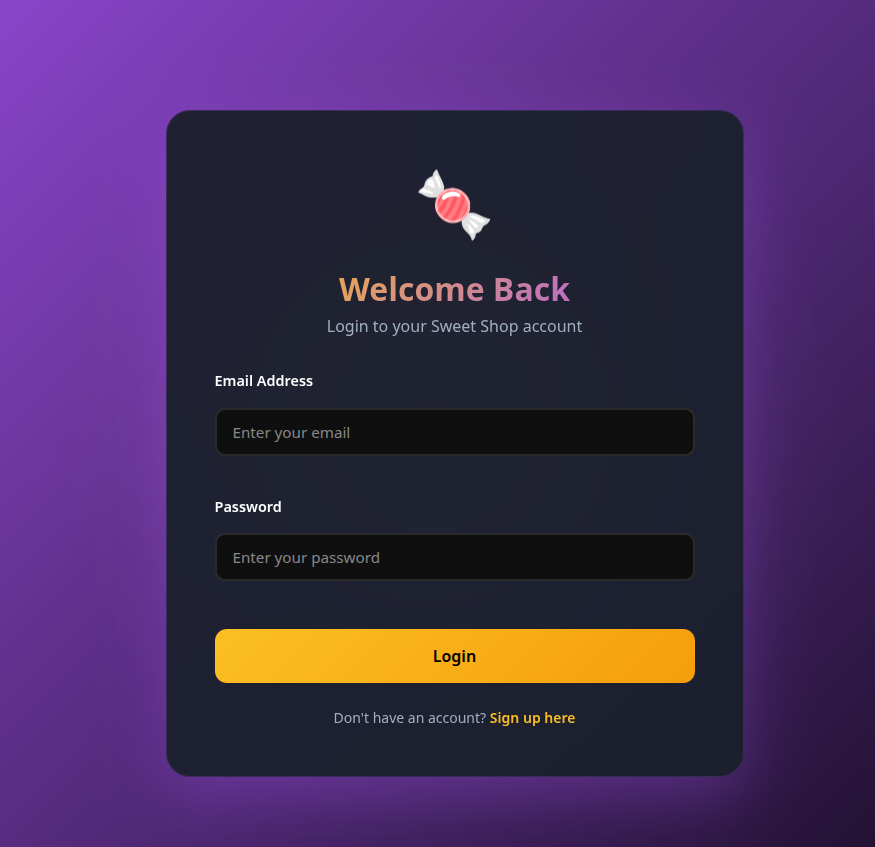
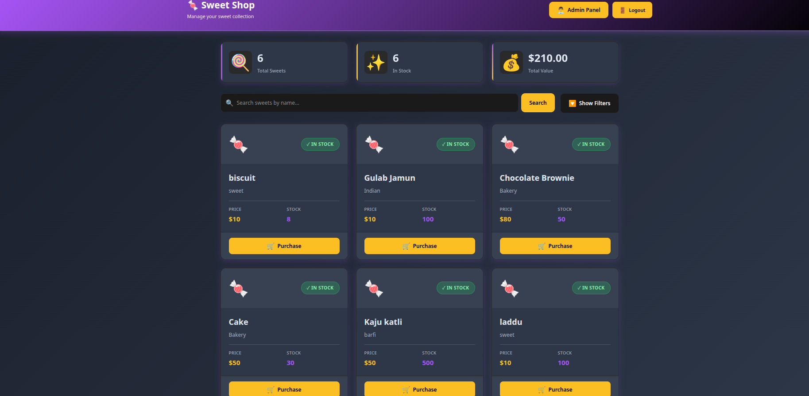
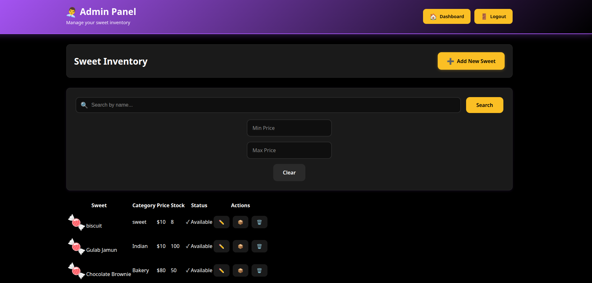

# 🍬 Sweet Shop Management System

## 📌 Overview
The Sweet Shop Management System is a full-stack web application developed as part of a technical assessment. 
It allows users to browse, search, and purchase sweets, while administrators manage inventory through secure,
role-based protected APIs. The backend follows Test-Driven Development (TDD) principles, and the frontend is
implemented as a modern Single Page Application (SPA).

## ✨ Features

### 👤 User
- User registration and login
- View list of available sweets
- Search and filter sweets
- Purchase sweets (disabled when quantity is zero)

### 🛠 Admin
- Add new sweets
- Update sweet details
- Delete sweets
- Restock sweets
- Role-based access control (ADMIN / USER)

## 🧰 Tech Stack

Backend: Node.js, Express.js, MongoDB, Mongoose, JWT Authentication, Jest, Supertest  
Frontend: React (Vite), Axios, Context API, CSS

## ⚙️ Setup Instructions

Backend Setup:
cd server
npm install
Create a .env file with:
PORT=8000
MONGODB_URI=mongodb://localhost:27017/sweetshop
MONGODB_URI_TEST=mongodb://localhost:27017/sweetshop_test
JWT_SECRET=your_secret_key
Start MongoDB locally and run:
npm run dev

Frontend Setup:
cd incube-frontend
npm install
npm run dev
Open in browser: http://localhost:5173

## 🧪 Running Tests
The backend strictly follows Test-Driven Development (TDD).
To run tests:
cd server
npm test

## 📊 Test Report
Total Test Suites: 15  
Total Tests: 20  
Status: ✅ All Passed  
Framework: Jest + Supertest  
Database: MongoDB (separate test database)

## 🖼 Screenshots
Login Page  

Dashboard (Sweets List)  

Admin Panel  

## [Click here to see Application live ](https://kata-sweet.devashish.top)

## 🤖 AI Usage Disclosure

AI Tools Used:
ChatGPT (OpenAI)  
GitHub Copilot (limited usage)

How I Used AI:
AI tools were used as productivity and learning assistants to clarify backend architecture and REST API design,
debug errors, understand best practices for Express.js, MongoDB, authentication and authorization, structure
frontend components, manage API calls with Axios, and refine project documentation.

All core logic, implementation decisions, and final code were written and reviewed by me. AI-generated suggestions
were selectively adapted and validated through testing.

Reflection on AI Impact:
AI significantly improved development speed and helped unblock issues faster, especially during debugging and
architectural planning. I ensured full understanding of the codebase and validated functionality through testing.
