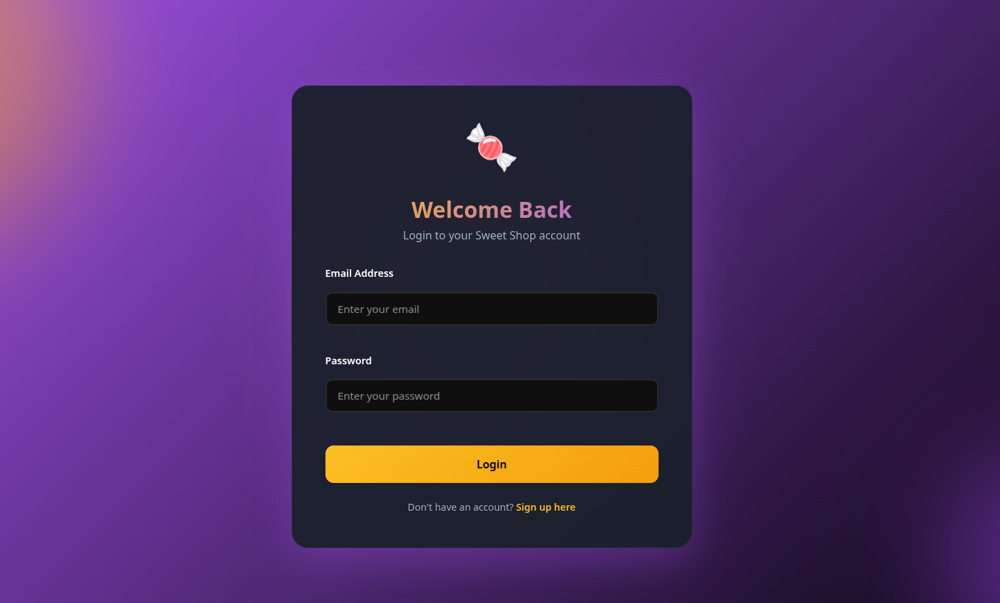

# 🍬 Sweet Shop Management System

## Overview

This is a full-stack **Sweet Shop Management System** built as part of a technical assessment.  
The application allows users to browse and purchase sweets, while administrators can manage
inventory through protected APIs.

The backend follows **Test-Driven Development (TDD)**, and the frontend is built as a modern
**Single Page Application (SPA)**.

---

## Features

### User
- User registration and login
- View list of available sweets
- Search and filter sweets
- Purchase sweets (disabled when quantity is zero)

### Admin
- Add new sweets
- Update sweet details
- Delete sweets
- Restock sweets
- Role-based access control (ADMIN / USER)

---

## Tech Stack

### Backend
- Node.js
- Express.js
- MongoDB
- Mongoose
- JWT Authentication
- Jest & Supertest (Testing)

### Frontend
- React (Vite)
- Axios
- Context API
- CSS

---

## Setup Instructions

### Backend Setup

1. Navigate to backend folder:
   ```bash
   cd server
Install dependencies:

npm install


Create a .env file:

PORT=8000
MONGODB_URI=mongodb://localhost:27017/sweetshop
MONGODB_URI_TEST=mongodb://localhost:27017/sweetshop_test
JWT_SECRET=your_secret_key


Start MongoDB locally.

Start backend server:

npm run dev

Frontend Setup

Navigate to frontend folder:

cd incube-frontend


Install dependencies:

npm install


Start frontend server:

npm run dev


Open in browser:

http://localhost:5173

Running Tests

The backend strictly follows Test-Driven Development (TDD).

To run all backend tests:

cd server
npm test

Test Report

Total Test Suites: 15

Total Tests: 20

Status: ✅ All Passed

Framework: Jest + Supertest

Database: MongoDB (separate test database)

Screenshots
Login Page
<!-- ADD IMAGE HERE -->

Dashboard (Sweets List)
<!-- ADD IMAGE HERE -->

Admin Panel
<!-- ADD IMAGE HERE -->
Test Execution (npm test)
<!-- ADD IMAGE HERE -->
My AI Usage
AI Tools Used

ChatGPT (OpenAI)

GitHub Copilot (limited usage)

How I Used AI

I used AI tools as productivity and learning assistants, not as a replacement for development.

Specifically:

To clarify backend architecture decisions and REST API design

To understand and debug error messages

To get guidance on best practices for Express.js, MongoDB, authentication, and authorization

To assist in structuring frontend components and managing API calls using Axios

To help write and refine documentation for the project

All core logic, implementation decisions, and final code were written and reviewed by me.
AI-generated suggestions were selectively adapted to fit the project requirements.

Reflection on AI Impact

Using AI significantly improved my development speed and helped unblock issues faster,
especially during debugging and architectural planning. However, I ensured that I fully
understood every piece of code and validated functionality through testing.

I believe AI, when used responsibly, enhances developer productivity while still requiring
strong foundational knowledge and critical thinking.